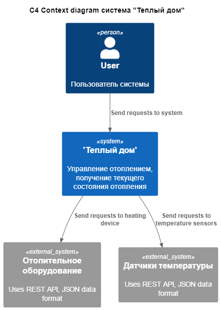

# Задание 1. Анализ и планирование

Чтобы составить документ с описанием текущей архитектуры приложения, можно часть информации взять из описания компании условия задания. Это нормально.

### 1. Описание функциональности монолитного приложения

**Управление отоплением:**

- Пользователи могут удалённо включать/выключать отопление в своих домах;
- Система поддерживает управление отопительными устройствами(включение, выключение отопления и установка целевой температуры).

**Мониторинг температуры:**

- Пользователи могут просматривать текущую температуру в своих домах через веб-интерфейс;
- Система поддерживает получение значения температуры с датчиков, установленных в домах.

### 2. Анализ архитектуры монолитного приложения

Архитектура приложения выполненна в качестве монолита. Все компоненты системы находятся в рамках одного приложения;
Язык программирования: Java + SpringBoot;
База данных: PostgreSQL;
Взаимодействие: Синхронное;
Масштабируемость: Не возможна, т.к. нет возможности блокировки параллельного изменения данных;
Развёртывание: Переустановка/установка всего приложения при помощи Helm
Инфраструктура: Использование Docker образовю вкачестве оркестрации используется Minikube.

### 3. Определение доменов и границы контекстов

-Домен: Отопление
  - Поддомен: управление отопительным оборудованием
    - Контекст: включение отопления
    - Контекст: выключение отопления
    - Контекст: установка целевой температуры
  - Поддомен: контроль отопительного оборудования
    - Контекст: получение текущей температуры
    - Контекст: получение текущего состояния отопительного оборудования

### **4. Проблемы монолитного решения**

Если смотреть на данное монолитное решение как на MVP, то вполне себе возможный вариант. Но т.к. планируется резкое увеличения количества разработчиков и нагрузки на систему, то при сохранении текущей архитектуры приложения будут появляться проблемы:
 - Снижение скорости разработки;
 - Не возможно масштабировать отдельные компоненты, которые будут подвергаться бОльшей нагрузке;
 - Снижение надежности из-за сильной связности компонентов и трудности тестирования внутренних процессов, что может привести к отказу работы всего приложения;
 - Не возможность привнести в проект ту или иную технорлогию
 - Размертывание системы будет проходить только через полную остановку работы всего приложения. Так же из-за увеличения кодовой базы старт приложения может быть длительным или вообще не состояться;

### 5. Визуализация контекста системы — диаграмма С4

# Задание 2. Проектирование микросервисной архитектуры

В этом задании вам нужно предоставить только диаграммы в модели C4. Мы не просим вас отдельно описывать получившиеся микросервисы и то, как вы определили взаимодействия между компонентами To-Be системы. Если вы правильно подготовите диаграммы C4, они и так это покажут.

**Диаграмма контейнеров (Containers)**

Добавьте диаграмму.

**Диаграмма компонентов (Components)**

Добавьте диаграмму для каждого из выделенных микросервисов.

**Диаграмма кода (Code)**

Добавьте одну диаграмму или несколько.

# Задание 3. Разработка ER-диаграммы

Добавьте сюда ER-диаграмму. Она должна отражать ключевые сущности системы, их атрибуты и тип связей между ними.
